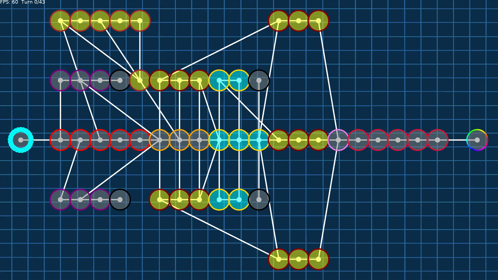
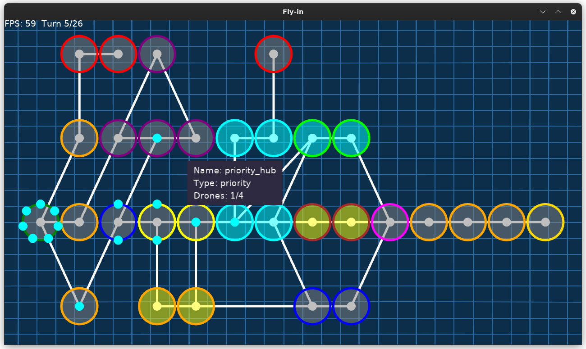

*This project has been created as part of the 42 curriculum by smakkass.*
# Drone Routing Simulator


Simulate and visualize drone routing on a user-defined map, ensuring safe, capacity-aware, and collision-free schedules.

<p align="center">
  
</p>

---

## Overview

The project parses a simple textual map format, validates graph constraints, computes per-drone paths with time-based reservations, and visualizes the result with an interactive UI.

---

## Getting Started

**Quick run (Make)**
```bash
make run
```

**Direct run (Python)**
```bash
python -m src --map <path-to-map>
```

---

## Algorithm Choices & Implementation Strategy

### Parsing & Validation
A three-stage flow — lexer, parser, validator — ensures map syntax correctness and semantic checks:
- Unique zones
- Valid colors
- Connectivity
- Start/end hubs

### Pathfinding & Scheduling
Uses a Dijkstra-like search over turns with a `ReservationTable` to prevent exceeding zone/connection capacity.

### Reservation Approach
Each reconstructed path reserves zone and connection slots per turn, so subsequent drone pathfinding avoids conflicts, enabling simple greedy scheduling of multiple drones.

---

## Visual Representation

**Renderer:** Built with [`arcade`](https://api.arcade.academy/en/stable/). The visual flow converts internal `Map` / `Connection` / `Zone` objects into simple nodes and edges.

<p align="center">
  
</p>

### Controls

| Input | Action |
|---|---|
| Mouse | Zoom / Pan map view |
| `←` / `→` | Retract / Advance a turn |
| `M` | Toggle map view |
| `D` | Toggle drone view |
| `P` | Toggle info popup |
| `F` | Toggle fullscreen |
| `R` | Reset map view and turn |

### Why It Helps
Visualizing per-turn positions clarifies scheduling decisions, highlights bottlenecks (restricted zones, narrow links), and helps debug map definitions and drone interactions.

---

## Project Structure

```
Fly-in/
├─ Makefile
├─ pyproject.toml
├─ README.md
├─ maps/
│  ├─ README.md
│  ├─ easy/
│  ├─ medium/
│  └─ hard/
└─ src/
  ├─ __main__.py
  ├─ classes.py
  ├─ simulation.py
  ├─ map_parser/
  │  ├─ __init__.py
  │  ├─ classes.py
  │  ├─ lexer.py
  │  ├─ parser.py
  │  ├─ validator.py
  │  └─ errors.py
  └─ visualizer/
    ├─ converter.py
    ├─ visualizer.py
    ├─ map.py
    ├─ drone.py
    ├─ scaler.py
    └─ constants.py
```

---

## Resources

<details>
<summary><strong>Parsing</strong></summary>

- [Video: Lexing & Parsing Basics](https://www.youtube.com/watch?v=BI3K-ME3L74)
- [Video: Building a Parser](https://www.youtube.com/watch?v=MBpMYTTEvLU)
- [Wikipedia: Lexical Analysis](https://en.wikipedia.org/wiki/Lexical_analysis)
- [Video: Parsing Techniques](https://www.youtube.com/watch?v=HuSCzN5IPAo)
- [Video: Parser Implementation](https://www.youtube.com/watch?v=UOf73eA3Xn0)

</details>

<details>
<summary><strong>Algorithm</strong></summary>

- [Wikipedia: Dijkstra's Algorithm](https://en.wikipedia.org/wiki/Dijkstra%27s_algorithm)
- [Video: Dijkstra's Algorithm Explained](https://www.youtube.com/watch?v=bZkzH5x0SKU)
- [Video: Pathfinding Algorithms](https://www.youtube.com/watch?v=n1VUnHD62r0)

</details>

<details>
<summary><strong>Arcade</strong></summary>

- [Arcade API Docs](https://api.arcade.academy/en/stable/)
- [Arcade Learning Guide](https://learn.arcade.academy/en/latest/index.html)

</details>

<details>
<summary><strong>Background Image</strong></summary>

- [Blueprint Chart Paper Texture](https://www.magnific.com/free-vector/blueprint-chart-paper-with-grid-lines-texture_426016662.htm)

</details>

---

## AI Usage

AI was used to add concise docstrings across the codebase and to draft this README.

---